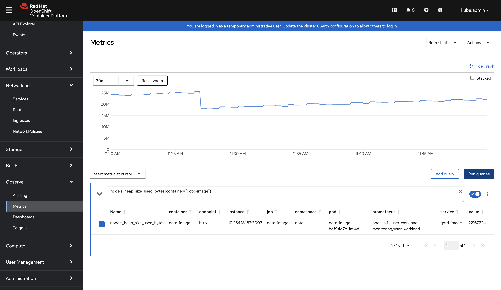
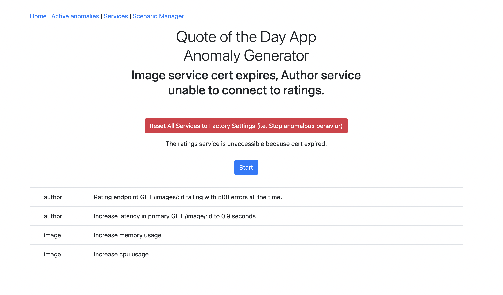
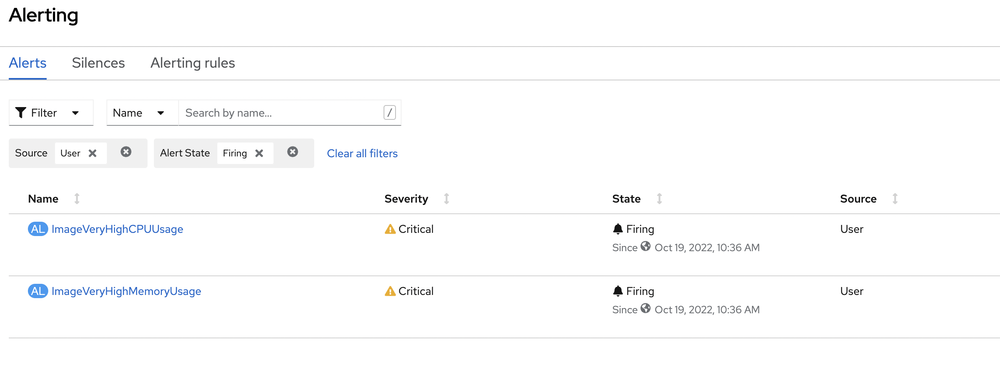
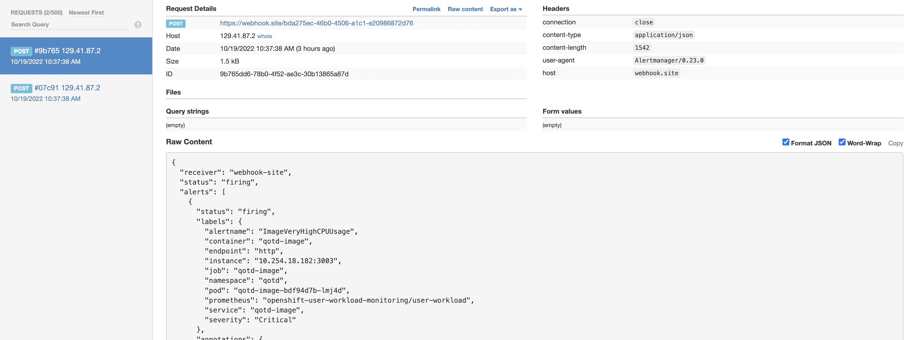
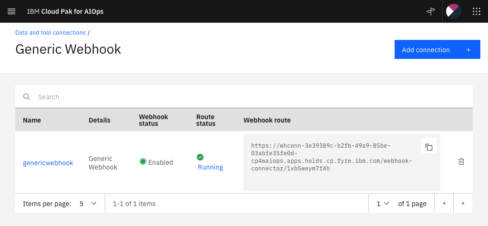

# Prometheus configuration

As a convenience to those using or wanting to use Prometheus on OpenShift to collect QotD metrics and generate alerts, we have included the OpenShift assets for doing so in the `resources/prometheus` (thanks Ricardo) folder. For deploying such assets to your OpenShift cluster, we assume you will use an OpenShift cluster administrator userID. Otherwise, you'll need to take additional steps for monitoring and collecting QotD metrics (doing so using a **non** administrative userID is beyond the scope of this document). Also, we assume you are using OpenShift version that supports monitoring of user-defined projects (for more details see [Enabling monitoring for user-defined projects](https://docs.openshift.com/container-platform/4.15/monitoring/enabling-monitoring-for-user-defined-projects.html) -- the commands below were tested on OpenShift v4.15).

1. First clone the repository to your local workstation.

    ```shell
    git clone https://gitlab.com/quote-of-the-day/quote-of-the-day.git
    ```

1. Navigate to the `resources/prometheus` folder.

1. Using the OpenShift CLI, create the `cluster-monitoring-config` `ConfigMap` object in the `openshift-monitoring` project:

    ```shell
    oc apply -f cluster-monitoring-config.yaml
    ```

1. Wait for all pods in the `openshift-user-workload-monitoring` project to come up:

    ```shell
    oc get pods -n openshift-user-workload-monitoring
    ```

    ```shell
    NAME                                   READY   STATUS    RESTARTS   AGE
    prometheus-operator-8665f65566-g9mwx   2/2     Running   0          7d4h
    prometheus-user-workload-0             4/4     Running   1          7d4h
    prometheus-user-workload-1             4/4     Running   1          7d4h
    thanos-ruler-user-workload-0           3/3     Running   0          7d4h
    thanos-ruler-user-workload-1           3/3     Running   0          7d4h
    ```

1. Create a `ServiceMonitor` instance for QotD.

    ```shell
    oc apply -f service-monitor.yaml
    ```

1. Deploy the the alerting rules.

    ```shell
    oc apply -f rules_author.yml -f rules_image.yml -f rules_rating.yml -f rules_web.yml -f rules_quote.yml
    ```

1. Once all steps above are completed, wait about a minute or so and then validate that Prometheus metrics from QotD are scraped as expected by going to your OpenShift console and navigating to the `Observe` -> `Metrics` view. On the `Metrics` panel, execute the `nodejs_heap_size_used_bytes{container="qotd-image"}` query to gather the `nodejs_heap_size_used_bytes` metric from the container named `qotd-image`:

    

## Creating the alerts receiver

After executing the above steps and validating that the Prometheus alerts from QotD are visible on your Openshift console, the next step is to define a receiver for these alerts. In our case, the final receiver is the CP4AIOps console which will be accessible through it's configured webhook.

### Creating a receiver for the webhook-site

Before we connect to the "[Generic Webhook connection](https://www.ibm.com/docs/en/cloud-paks/cloud-pak-aiops/4.3.0?topic=connections-generic-webhook)" configured in CP4AIOps, let's test the flow of alerts using the [webhook site](https://webhook.site/), which is an excellent free tool to test, inspect, and automate incoming HTTP requests using an instantly generated unique URL. Before we proceed, ensure you have access to the cluster as a user with the `cluster-admin` role. You can read [this](https://github.ibm.com/AIOps-Elite-Team/Hints-Tips/blob/master/ocp-monitoring/README.md) document to learn more about configuring Alertmanager and it's webhook integration.

1. Firstly, to find your webhook URL to which you will be sending alerts to, go to the [webhook site](https://webhook.site/) and copy your unique URL. Define the `WEBHOOK_ROUTE` environment varible with the unique URL you copied from the webhook-site.

    ```
    export WEBHOOK_ROUTE = <Your webhook URL>
    ```

1. Next, execute this command to add your webhook route to the `alertmanager.yaml` file.

    ```
    sed -i '' "s/<webhook route>/$WEBHOOK_ROUTE/g" alertmanager.yaml
    ```

1. Run the following command to update the Alertmanager configuration and add the webhook-site as the only receiver URL.

    ```
    oc -n openshift-monitoring create secret generic alertmanager-main --from-file=alertmanager.yaml --dry-run=client -o=yaml |  oc -n openshift-monitoring replace secret --filename=-
    ```

1. To generate alerts and test the connection to the webhook site, navigate to your `Quote of the Day App Anomaly Generator`, and click on the second option which is the `Image service cert expires, Author service unable to connect to ratings` option and press the `Start` button as shown in the picture below.

    

1. While the anomalies are being generated, on your Openshift console navigate to `Observe` > `Alerting` and under the `Alerts` tab, switch the filters on for `Firing` and `User`. After around 2 minutes you will be able to see the two user-generated alerts in the firing status as shown below.

    

1. After you see the alerts being fired on your Openshift console, navigate to the webhook-site and you should be able to see the two alerts generated there as shown in the picture below.

    

Once you have confirmed that the alerts are visible on the webhook-site, you can proceed to create another receiver to forward alerts to the CP4AIOps.

### Creating a receiver for the Generic Webhook connection configured in CP4AIOps

Firstly, as a pre-requisite for creating a receiver for the CP4AIOps you need to deploy and configure CP4AIOps Generic Webhook connection by following the steps [here](<https://www.ibm.com/docs/en/cloud-paks/cloud-pak-aiops/4.3.0?topic=connections-generic-webhook>). During Configuration of Generic Webhook, load `Prometheus AlertManager` sample mapping.

After Generic Webhook configuration is completed, a `Webhook route` URL is provided as shown on the picture and should look similar to: 

```
https://whconn-3e39389c-b2fb-49a9-85be-03abfe35fe0d-cp4waiops.apps.holds.cp.fyre.ibm.com/webhook-connector/1xb5weym7f4h
```



You will need that URL for [Creating a receiver for the webhook-site](#creating-a-receiver-for-the-webhook-site) section, but in the first step, initialize the `WEBHOOK_ROUTE` environment variable with your generic webhook probe route URL.

**Congratulations! You have successfully created the webhook probe receiver.**

## References

* [Enabling monitoring for user-defined projects](https://docs.openshift.com/container-platform/4.15/monitoring/enabling-monitoring-for-user-defined-projects.html)
* [Creating alerting rules for user-defined projects](https://docs.openshift.com/container-platform/4.15/monitoring/managing-alerts.html)
* [Configuring and using the monitoring stack in OpenShift Container Platform](https://access.redhat.com/documentation/en-us/openshift_container_platform/4.15/html/monitoring/configuring-the-monitoring-stack)
* [Specifying how a service is monitored](https://docs.openshift.com/container-platform/4.15/monitoring/managing-metrics.html#specifying-how-a-service-is-monitored_managing-metrics)
* [ServiceMonitor](https://docs.openshift.com/container-platform/4.15/rest_api/monitoring_apis/servicemonitor-monitoring-coreos-com-v1.html)
* [How to configure Prometheus-Operator & scrape metrics from Istio 1.6](https://www.tetrate.io/blog/how-to-configure-prometheus-operator-scrape-metrics-from-istio-1-6/)
* [PromQL / How to return 0 instead of ‘no data’](https://nklya.medium.com/promql-how-to-return-0-instead-of-no-data-9e49f7ccb80d)
* [Applying a custom alert manager configuration](https://docs.openshift.com/container-platform/4.15/monitoring/managing-alerts.html#applying-custom-alertmanager-configuration_managing-alerts)
